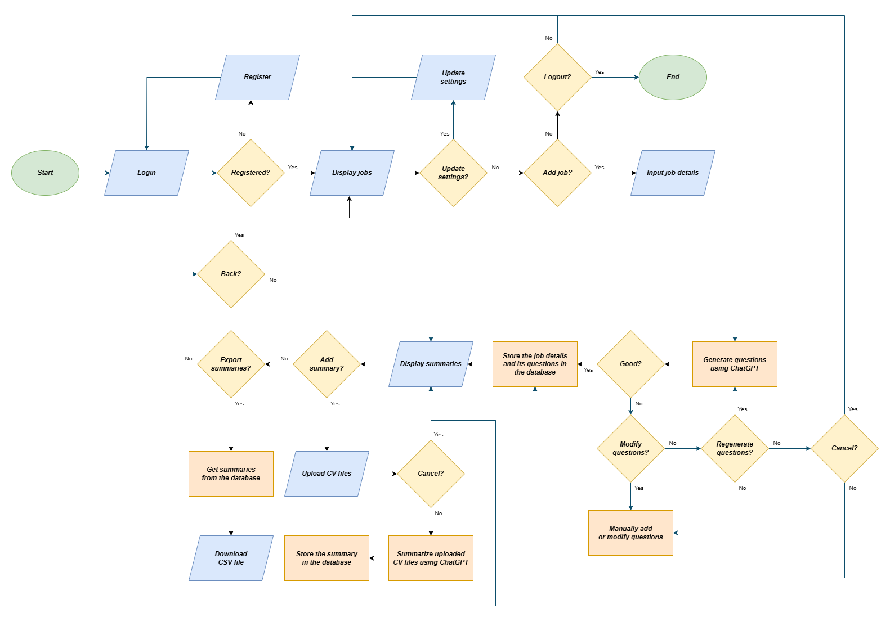
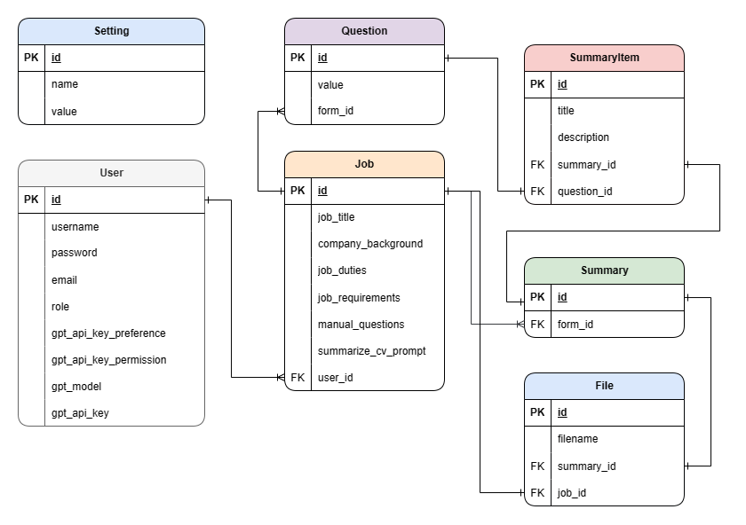
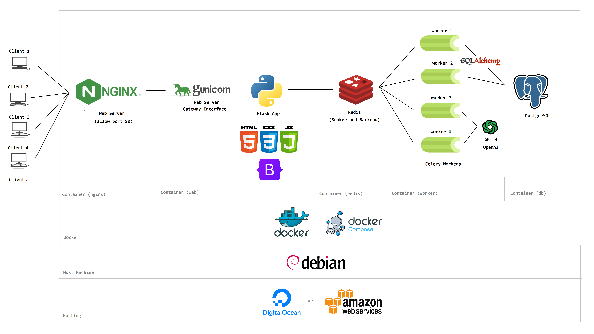
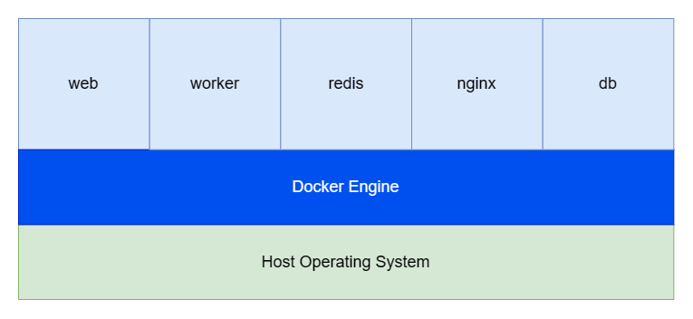

# 💻 A.I CV Scanner Pro

The project involves developing an AI solution utilizing GPT technology to assist recruiters in identifying suitable candidates. Currently confined to a command-line interface, the goal is to enhance accessibility through the creation of a functional website.

  
⚙️ <strong>System Flowchart</strong>

   
  

  
🛢️ <strong>Database Schema</strong>

   
  

## Dependencies Used
- **Flask** 
  A lightweight and flexible web framework for Python. It simplifies the process of building web applications by providing a set of tools for routing, templating, and interacting with databases. Flask follows the WSGI standard and is known for its simplicity and extensibility.
  
- **Celery** 
  A distributed task queue system for asynchronous processing. It allows you to run tasks in the background, making it useful for handling time-consuming operations independently from the main application.
- **Redis** 
  An in-memory data structure store that can be used as a cache and message broker. It is commonly used to store key-value pairs, manage distributed locks, and as a backend for Celery to handle task queues.
  
- **Gunicorn** 
A WSGI HTTP server for running Python web applications. It acts as a bridge between the web server (like Nginx or Apache) and the Flask application, handling multiple concurrent requests efficiently.

- **PyJWT** 
  A Python library for JSON Web Tokens (JWT). It allows you to encode and decode JWTs, which are commonly used for authentication and information exchange between parties in a secure and compact way. PyJWT is often used in web applications to handle user authentication.
  
- **OpenAI** 
  The library or API provides access to various AI models and tools, enabling developers to integrate powerful natural language processing capabilities into their applications.

- **PyPDF2** 
  A Python library for reading and manipulating PDF files. It allows you to extract text, merge, split, and perform other operations on PDF documents.

- **docx2txt** 
A Python library that extracts text from Microsoft Word (.docx) files. It provides a simple way to access the content of Word documents programmatically.

- **SQLAlchemy** 
  A SQL toolkit and Object-Relational Mapping (ORM) library for Python. It provides a set of high-level API for interacting with relational databases, allowing developers to work with databases using Python objects.

- **bcrypt** 
A password-hashing library that uses a salted hash to securely store passwords. It's designed to be slow and computationally expensive, making it resistant to brute-force attacks.

- **psycopg2** 
  A PostgreSQL adapter for Python. It allows Python applications to connect to and interact with PostgreSQL databases, providing a convenient interface for working with PostgreSQL from Python code.

## Docker Compose Services

  
🔍 <strong>General Overview</strong>

   
  
  

### 1. Web Service (`web`)
- **Description:** The web service hosts the main application.
- **Build Context:** The Dockerfile in the `./app` directory is used to build the web service.
- **Ports:** Maps host port 1235 to container port 1235.
- **Dependencies:** Depends on the Celery worker (`worker`) and Redis (`redis`) services. Waits for them to be healthy before starting.
- **Volumes:**
  - Mounts the local `./app` directory to `/app` in the container.
  - Mounts the Docker volume named "files" to `/app/files` in the container for data persistence.

### 2. Celery Worker Service (`worker`)
- **Description:** The Celery worker service processes background tasks.
- **Build Context:** The Dockerfile in the `./tasks` directory is used to build the worker service.
- **Command:** Runs two Celery workers with specific configuration using supervisor.
- **Environment Variables:**
  - `CELERY_BROKER_URL` and `CELERY_RESULT_BACKEND` are set to use Redis as the message broker.
- **Healthcheck:**
  - Uses Celery's inspect ping command to check if Celery is responsive.
  - Health check interval, timeout, and retries are configured.
- **Dependencies:** Depends on Redis (`redis`) and the database (`db`) services. Waits for them to be healthy before starting.
- **Volumes:**
  - Mounts the local `./tasks` directory to `/tasks` in the container.
  - Mounts the Docker volume named "files" to `/tasks/files` in the container for data persistence.

### 3. Redis Service (`redis`)
- **Description:** Uses the official Redis Alpine image to provide a message broker.
- **Healthcheck:**
  - Uses the `redis-cli ping` command to check if Redis is responsive.
  - Health check interval, timeout, and retries are configured.

### 4. Nginx Service (`nginx`)
- **Description:** Nginx serves as a reverse proxy to the web service.
- **Image:** Uses the latest Nginx image.
- **Volumes:** Mounts the local `./nginx.conf` file to Nginx configuration.
- **Ports:** Maps host port 80 to container port 80.
- **Dependencies:** Depends on the web service (`web`). Waits for it to be running before starting.

### 5. Database Service (`db`)
- **Image:** Uses the latest PostgreSQL image.
- **Volumes:** Mounts the Docker volume named "postgres_data" to `/var/lib/postgresql/data/` for database data persistence.
- **Environment Variables:** Sets PostgreSQL user, password, database name, etc.
- **Healthcheck:**
  - Uses the `pg_isready` command to check if PostgreSQL is ready.
  - Health check interval, timeout, retries, and start period are configured.

## Volumes
- **files:** Docker volume for the web and worker services to persist data.
- **postgres_data:** Docker volume for the PostgreSQL database to persist data.
